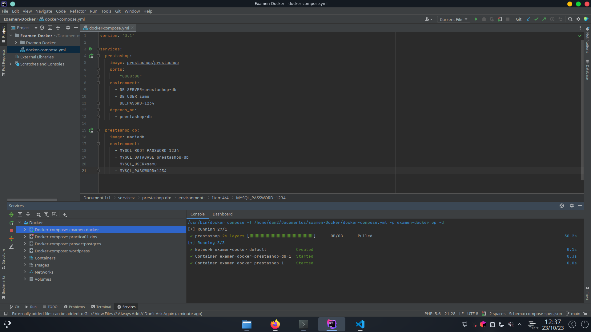
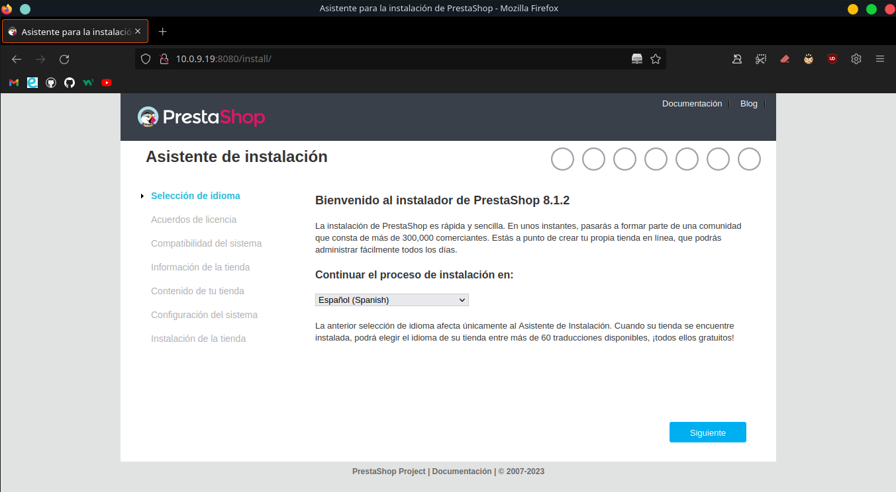
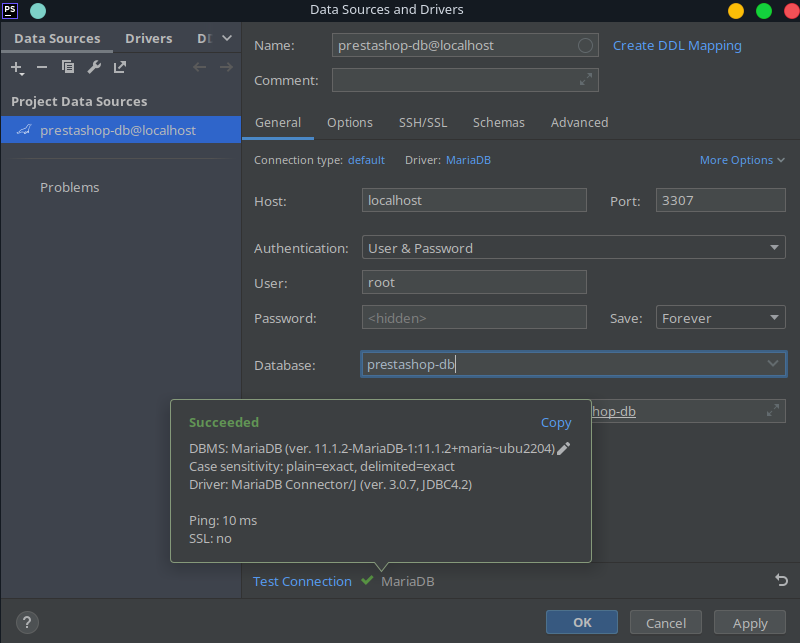
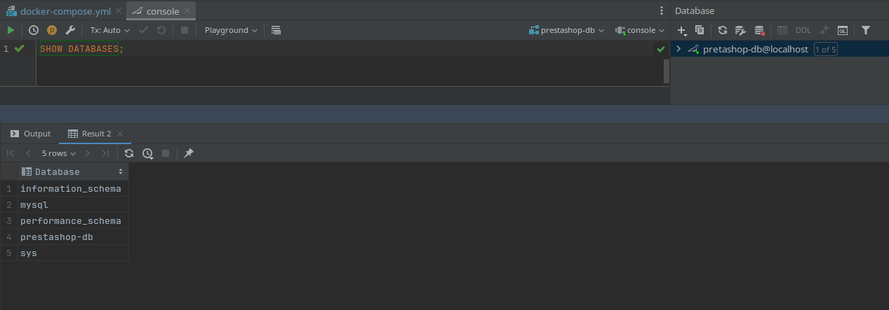
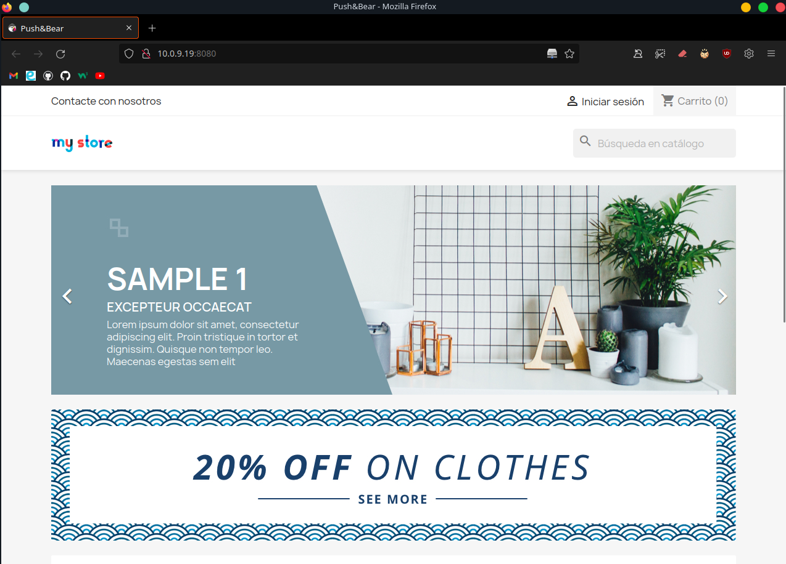

# Levantar Prestashop para MariaDB

Este archivo de Docker Compose está hecho para levantar un entorno de desarrollo en Prestashop junto a una base de datos MariaDB. Para ello levantaremos dos contenedores: uno para ejecutar Prestashop y otro para alojar la base de datos con MariaDB.

## Análisis del fichero docker-compose

```
version: '3.1'

services:
  prestashop:
    image: prestashop/prestashop
    ports:
      - "8080:80"
    environment:
      - DB_SERVER=prestashop-db
      - DB_USER=samu
      - DB_PASSWD=1234
    depends_on:
      - prestashop-db

  prestashop-db:
    image: mariadb
    ports:
      - "3307:3306"
    environment:
      - MYSQL_ROOT_PASSWORD=1234
      - MYSQL_DATABASE=prestashop-db
      - MYSQL_USER=samu
      - MYSQL_PASSWORD=1234
```

### Contenedor prestashop (Prestashop)

```
prestashop:
    image: prestashop/prestashop
    ports:
      - "8080:80"
    environment:
      - DB_SERVER=prestashop-db
      - DB_USER=samu
      - DB_PASSWD=1234
    depends_on:
      - prestashop-db
```

Este servicio levanta un contenedor Prestashop de nombre 'prestashop' con la siguiente configuración:

'image: prestashop/prestashop': Especifica la imagen de Docker que se utilizará para PrestaShop. En este caso, se utiliza la imagen oficial de PrestaShop disponible en Docker Hub.

'ports' Mapea el puerto 80 del contenedor de PrestaShop al puerto 8080 de nuestro sistema.

'environment': Declara las variables de entorno que PrestaShop utilizará para conectarse a la base de datos MariaDB. 

- DB_SERVER: Se establece en "prestashop-db" porque es el nombre del servicio del contenedor MariaDB. 
- DB_USER y DB_PASSWD: Nombre de usuario y la contraseña para conectarse a la base de datos.

'depends_on': Nos garantiza que el contenedor de PrestaShop se inicie **después** de que el contenedor de MariaDB esté funcionando.

### Contenedor prestashop-db (MariaDB)

```
  prestashop-db:
    image: mariadb
    ports:
      - "3307:3306"
    environment:
      - MYSQL_ROOT_PASSWORD=1234
      - MYSQL_DATABASE=prestashop-db
      - MYSQL_USER=samu
      - MYSQL_PASSWORD=1234

```

'prestashop-db': Nombre del servicio que ejecutará MariaDB.

'image': Especifica la imagen de Docker que se utilizará para MariaDB.

'ports' Mapea el puerto 3306 del contenedor de MariaDB al puerto 3307 de nuestro sistema.

'environment' Establece variables de entorno que configuran la base de datos MariaDB. 

- MYSQL_ROOT_PASSWORD: Contraseña del usuario root de la base de datos. 
- MYSQL_DATABASE: Nombre de la base de datos que se creará. 
- MYSQL_USER y MYSQL_PASSWORD: Nombre de usuario y la contraseña de la base de datos que PrestaShop utilizará para conectarse a MariaDB.

## Levantando los contenedores


_Contenedores levantados._

- Una vez levantados los contenedores si nos conectamos a localhost:8080 o (IP_equipo):8080 deberiamos ver algo como esto:


_Prestashop funcionando y alojado en el puerto '8080'._

Y si intentamos hacer conexión con la base de datos mediante PhPStorm veriamos algo como esto:


_Conexión con la base de datos 'prestashop-db' exitosa._

Si mostramos todas las tablas vemos que 'prestashop-db' se ha creado con éxito.

_Todas las tables de nuestra base de datos MariaDB._

Una vez configurada nuestra tienda veriamos esto al conectarnos


_Pagina principal de nuestra tienda 'Push&Bear'._